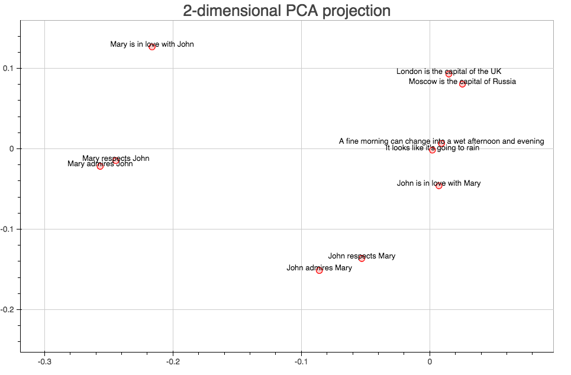

#  Deep sentence embedding using Sequence to Sequence learning



## Installing

1. [Install Torch](http://torch.ch/docs/getting-started.html).
2. Install the following additional Lua libs:

   ```sh
   luarocks install nn
   luarocks install rnn
   luarocks install penlight
   ```
   
   To train with CUDA install the latest CUDA drivers, toolkit and run:

   ```sh
   luarocks install cutorch
   luarocks install cunn
   ```
   
   To train with opencl install the lastest Opencl torch lib:

   ```sh
   luarocks install cltorch
   luarocks install clnn
   ```

3. Download the [Cornell Movie-Dialogs Corpus](http://www.mpi-sws.org/~cristian/Cornell_Movie-Dialogs_Corpus.html) and extract all the files into data/cornell_movie_dialogs.

## Training

```sh
th train.lua [-h / options]
```

Use the `--dataset NUMBER` option to control the size of the dataset. Training on the full dataset takes about 5h for a single epoch.

The model will be saved to `data/model.t7` after each epoch if it has improved (error decreased).

## Getting a pretrained model
Download the pretraned[model](https://drive.google.com/file/d/0BwsDa5L6bdMpTC1GUEtPbWE2Zms/view?usp=sharing) and put it into the data directory.

## Extracting embeddings from sentences
Run the following command
```sh
th -i extract_embeddings.lua --model_file data/model.t7 --input_file data/test_sentences.txt --output_file data/embeddings.t7 --cuda
```

## Acknowledgments
This implementation utilizes code from [Marc-André Cournoyer's repo](https://github.com/macournoyer/neuralconvo)

## License
MIT License
